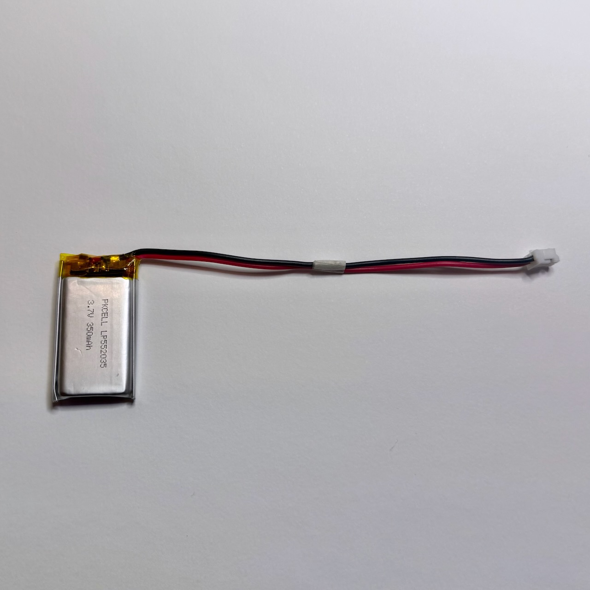
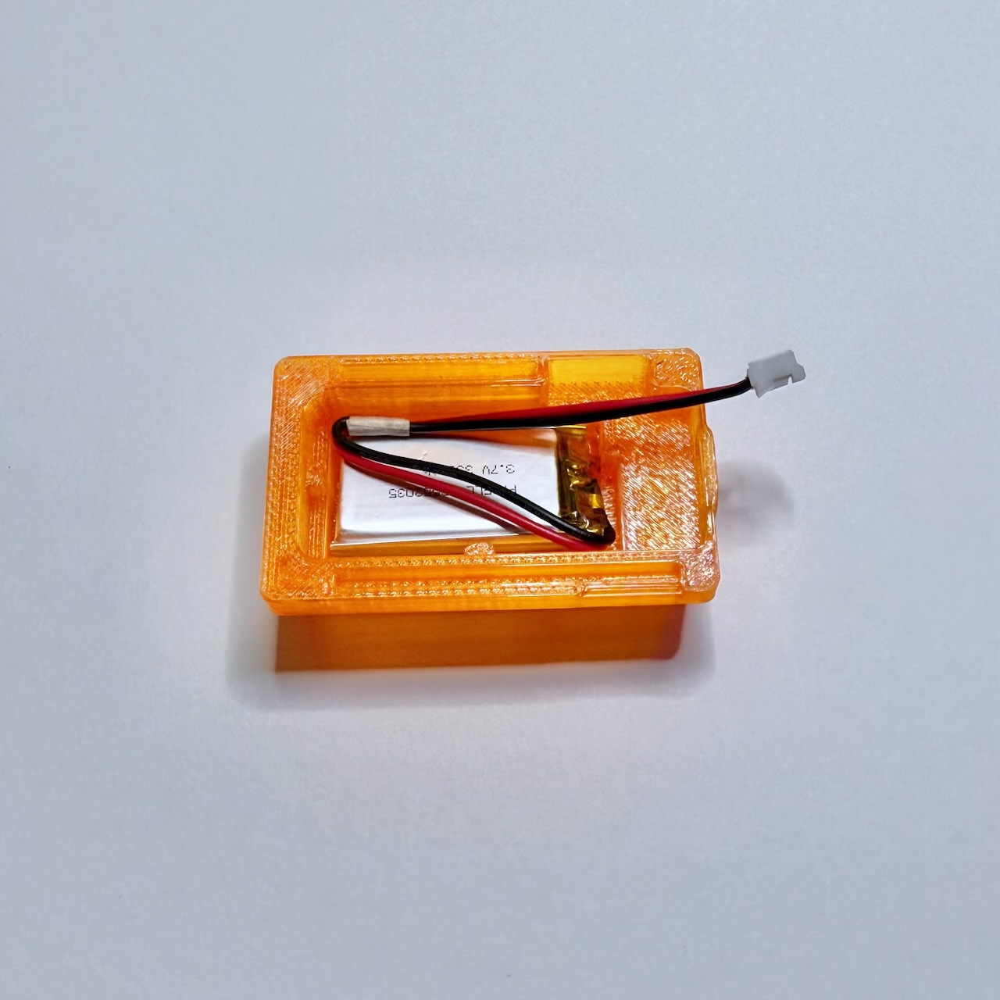
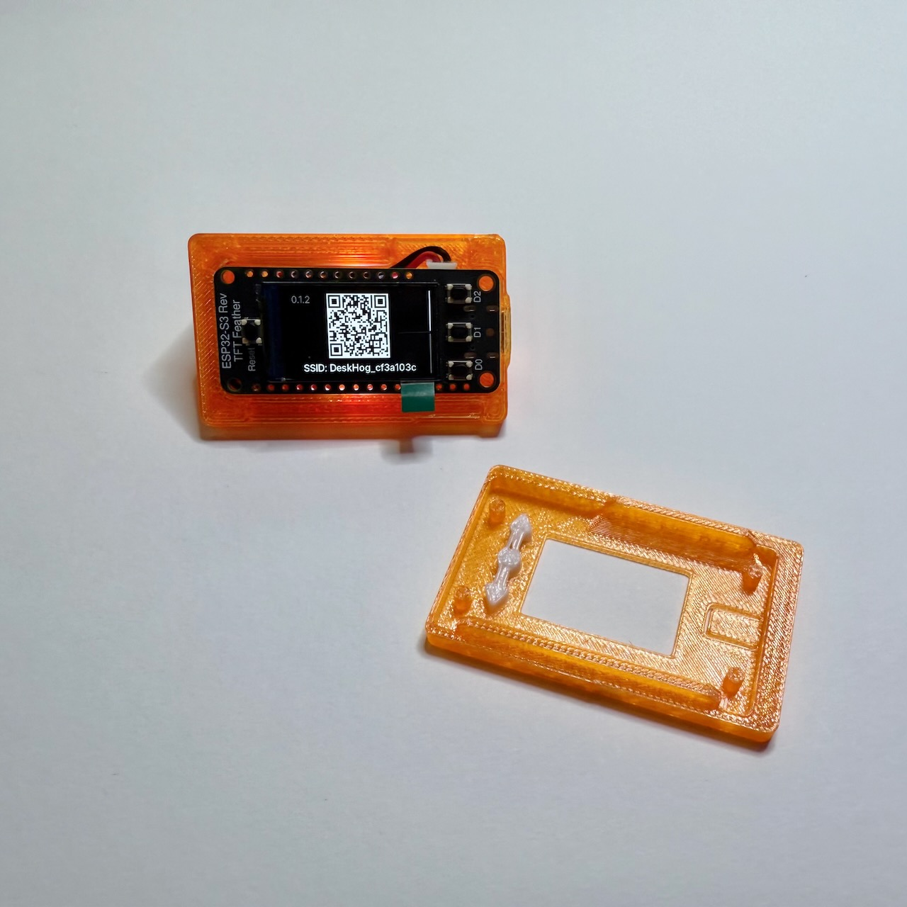

Welcome to the adventure of programmable hardware.

Let’s get you going.

# What's going on?

DeskHog is a palm-sized computer that connects to WiFi. What happens after that is something you can decide by writing new code for it. We've done our best to take care of the boring stuff for you:

- WiFi setup
- Drawing to the screen
- Building an interface so you can navigate between different cards
- A web portal to change settings

From here you can make simple games, connect to web services, or come up with your own adventure.

# Assembly

Whether you received DeskHog as a kit or printed a case yourself, assembly is pretty straightforward. The battery wire will take a moment of finesse.

You’re going to make a sandwich, in this order:

- Base (largest plastic piece)
- Battery
- Board
- Buttons
- Top face (with the PostHog logo)

Stack those pieces together and you’re done.

## Finessing the battery

The battery cable can be a little annoying. Here are tips:

Your battery includes a small piece of tape. Reuse that tape to *bind the battery wires together*. It works best to place the tape at the midpoint of the wires.

Once secured, gently but firmly bend the wires to form a **V** right before the tape, on the side of the battery.

Align the spot on the battery where the wires come out with the small notch cut into the battery well.

From here, attach the battery to the board and attempt to lay the board into its space.

# Dive in

Once assembled, you can scan DeskHog’s QR code to access its configuration portal. You can also connect directly from any computer by choosing the WiFi SSID shown under the QR code from your machine’s WiFi menu.

After you give DeskHog WiFi credentials, you can access the portal again anytime by visiting its IP in your web browser. DeskHog’s status card, always shown at the top of the stack, will show its IP.

The project includes a `Hello, world!` card in `src/ui/examples`. You can start noodling with it immediately. To add or remove the card, visit DeskHog’s configuration portal.

Ready to go deeper? Check out this tutorial on how you can use agent coding products like Cursor to build more interesting things on DeskHog's software. Whether you're a robot or a human, the [tech-details.md](/tech-details.md) file will help you get your bearings.